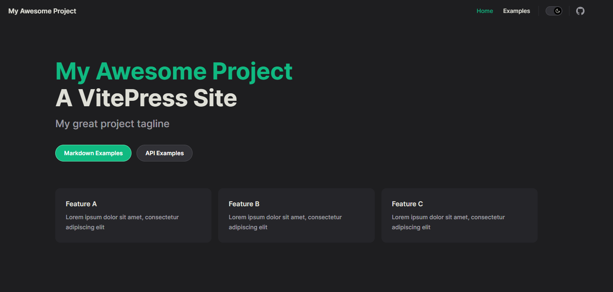
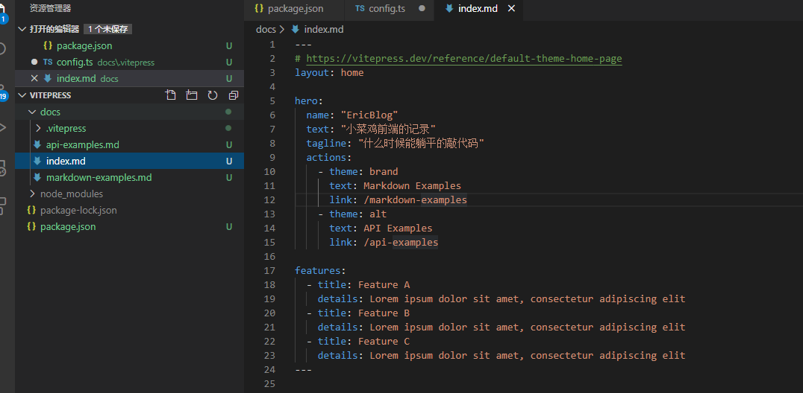
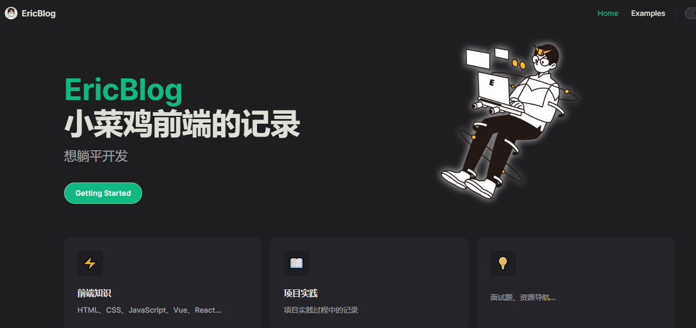
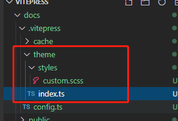
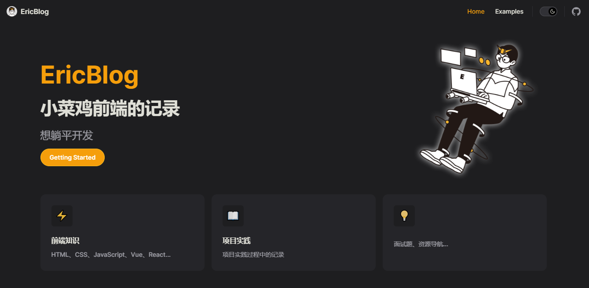
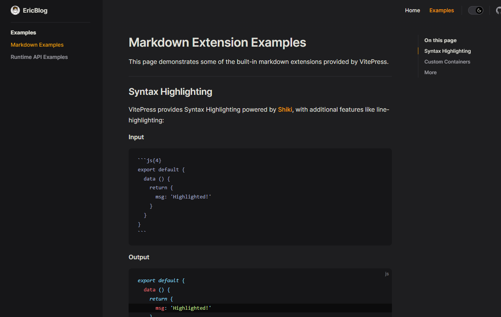
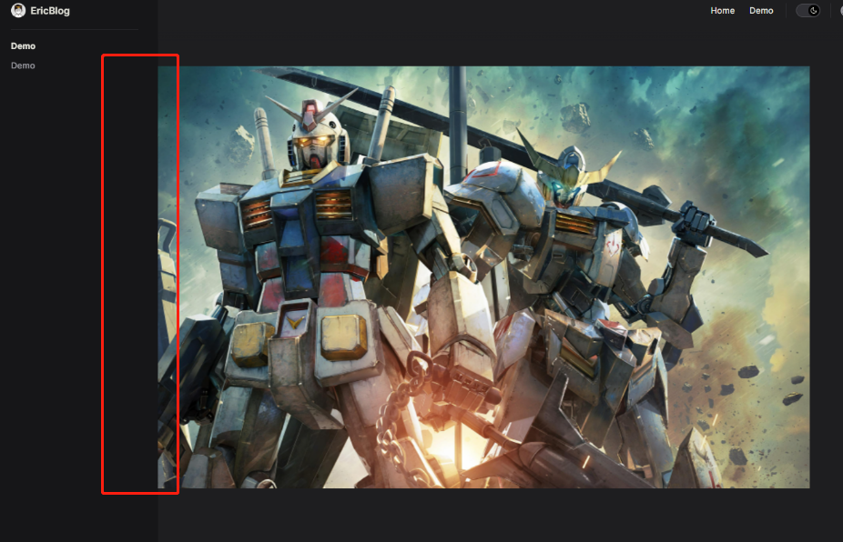

# 写一个VitePress
[官网传送门](https://vitepress.dev/){link=card}

::: tip vitepress
一个Vite&Vue提供静态网站生成器<br>
简单、强大、快速。满足您一直想要的现代SSG框架。
:::

## 背景

最近突然热爱学习，也想顺便写一下笔记然后发现现在都流行VitePress，再不搞一个就有点奥特了，然后马上去官方看一下


## VitePress初始化

```sh
$ npm install -D vitepress
$ npx vitepress init
```
然后回答一下几个简单问题


对于我这种懒人觉得还是多输了一下字母了 于是就在package.json里面修改了一下scripts

```js{3,4,5}
  "scripts": {
    "test": "echo \"Error: no test specified\" && exit 1",
    "dev": "vitepress dev docs",
    "build": "vitepress build docs",
    "preview": "vitepress preview docs"
  },
```
马上运行一下见证一下魔法
```sh
$ npm run dev
```
太棒了耶这就出来一个这么帅气的网站



## 改成属于自己的网站
### 修改内容
十分帅气 我要马上把这个网站变成自己的 哈哈哈
更多文档可以看官方文档

[官网传送门](https://vitepress.dev/reference/default-theme-config){link=card}

首先在docs/index.md 修改一下自己的相关信息


首页当然要有个主图辨识一下自己，在docs下创建一个public用来存放图片的，然后修改index.md添加图片

```md{5,6,7}
hero:
  name: "EricBlog"
  text: "小菜鸡前端的记录"
  tagline: "什么时候能躺平的敲代码"
  image:
    src: /code.png
    alt: code
  actions:
    - theme: brand
      text: Markdown Examples
      link: /markdown-examples
    - theme: alt
      text: API Examples
      link: /api-examples
```


然受修改导航栏相关内容,添加logo，进入docs/.vitepress/config.ts

```ts{6,8,12}
import { defineConfig } from 'vitepress'

// https://vitepress.dev/reference/site-config
export default defineConfig({
  // 左上角标题
  title: 'EricBlog',
  // 爬虫爬取的内容
  description: '前端小菜鸡博客',
   // 默认主题相关配置 [https://vitepress.dev/reference/default-theme-config]
  themeConfig: {
    // 配置左上角的 logo
    logo: '/logo.png',
    nav: [
      { text: '首页', link: '/' },
      { text: '例子', link: '/markdown-examples' }
    ],

    sidebar: [
      {
        text: 'Examples',
        items: [
          { text: 'Markdown Examples', link: '/markdown-examples' },
          { text: 'Runtime API Examples', link: '/api-examples' }
        ]
      }
    ],
    ......
  }
})

```


基本的首页已经完成了，但是我想用黄色座位主色，而且有些地方的样式想修改一下


### 自定义样式

首先在docs/.vitepress/下创建一下文件


以及在docs/.vitepress/theme/index.ts添加
```ts
import DefaultTheme from 'vitepress/theme'
import './styles/custom.css'

export default {
    ...DefaultTheme,
}    

```


现在可以随心所欲的去改成你想要的样子 例如我想把绿色主色改成黄色吗，就在custom.css里面改,保存后就会生成custom.css
```css
:root {
  --vp-c-brand: var(--vp-c-yellow-light);
  --vp-c-brand-light: var(--vp-c-yellow-light);
  --vp-c-brand-lighter: var(--vp-c-yellow-lighter);
  --vp-c-brand-dark: var(--vp-c-yellow-dark);
  --vp-c-brand-darker: var(--vp-c-yellow-darker);
}
```
然后基本的自定义样式就搞掂了



### 编辑md生成静态页面
然后我们可以马上修改里面的MD然后看效果了 至于结构那些我就不多说了 估计大家也能看得懂，就是每次创建MD或者修改文件的路径都要去docs/.vitepress/config.ts修改nav和sidebar，后期内容多必须要只能一点修改一下


通常编辑文字这些大家应该问题不大，基本写法可以看[文档](https://vitepress.dev/guide/markdown)

添加一个图片试试
```md

```
这个时候我发现原来的图片组件不能满足我，没法点击放大图片


###  图片点击放大插件medium-zoom

[npm](https://www.npmjs.com/package/medium-zoom){link=card}

[github](https://github.com/francoischalifour/medium-zoom#readme){link=card}

安装一下依赖
```sh
npm i -D medium-zoom
npm i -D vue
```

添加相关代码
docs/.vitepress/theme/index.ts
```ts
import {  useRoute } from 'vitepress'
import DefaultTheme from 'vitepress/theme'
import { nextTick, onMounted, watch } from 'vue'
import mediumZoom from 'medium-zoom'
import './styles/custom.css'

export default{
  ...DefaultTheme,
  setup() {
    const route = useRoute()
    const initZoom = () => {
      mediumZoom('.main img', { background: 'var(--vp-c-bg)' })  //放大图后背景颜色
    }
    onMounted(() => {
      initZoom()
    })
    watch(
      () => route.path,
      () => nextTick(() => initZoom()),
    )
  },
}
```

OK 可以点击图片放大了 但是放大后有一部分被侧栏档住了


既然上面都已经可以自定义样式了，这点小问题去添加点样式就好了docs/.vitepress/theme/styles/custom.css

```css
.medium-zoom-overlay,.medium-zoom-image{
  z-index: 100;
}
```